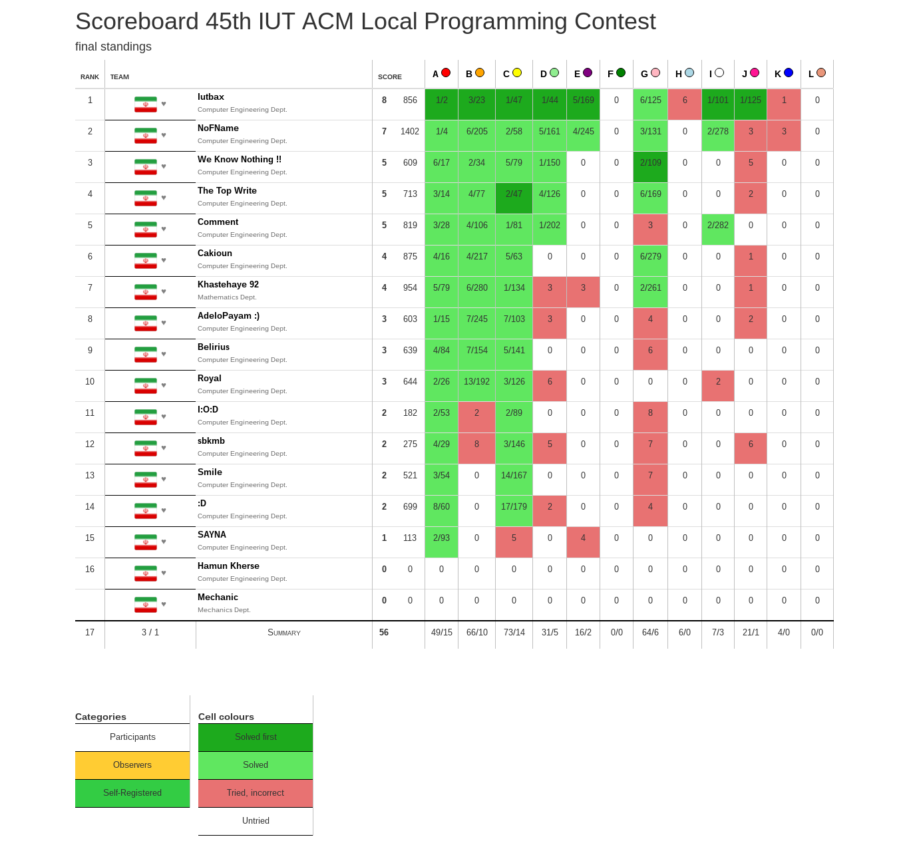
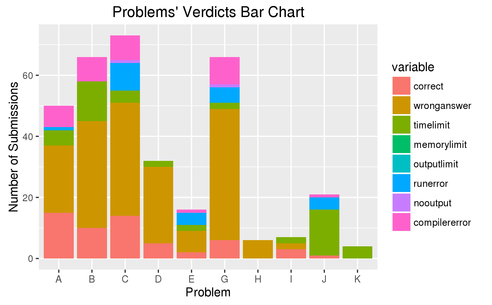
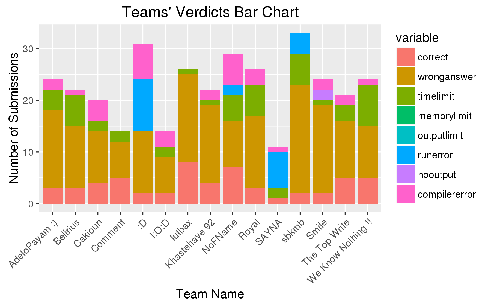
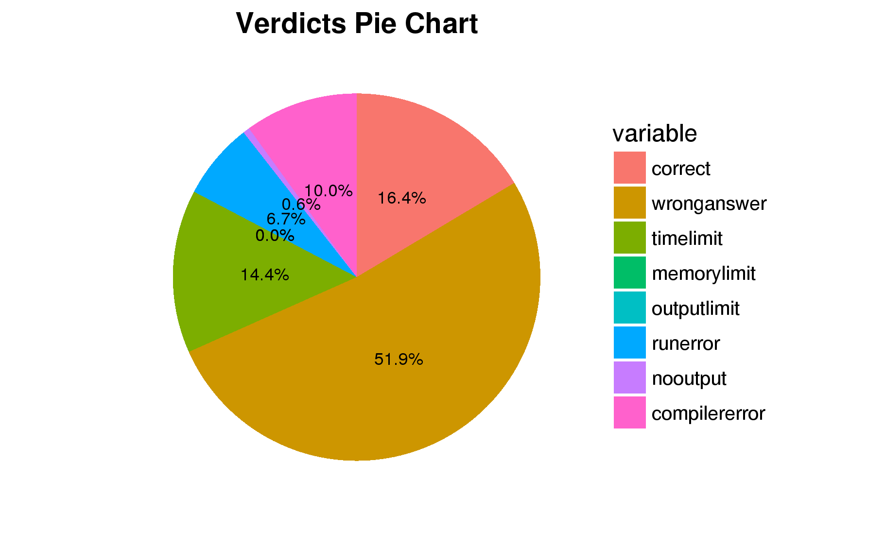

# 45th IUT ACM Local Programming Contest
2016 May 12  
Electronics and Computer Engineering Dept.  
IUT

* [Test Cases](test-cases): Each `input.txt` has a corresponding `output.txt`. for e.g.: `input1.txt -> output1.txt`
* (TODO) [Solutions](solutions)

## Final Scoreboard

## Plots

### Problems - Verdicts Bar Plot

### Teams - Verdicts Bar Plot

### Verdicts Pie Plot

