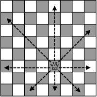

## Chess

### Solutions:

  همان‌طور که در شکل زیر مشخص است حرکت ملکه در ۸ جهت است:
  
  
  
  
  ۴ جهت افقی و عمودی و ۴ جهت به صورت قطری میباشند. اگر دقت کنید شاه برای رسیدن به مقصد خود میتواند بدون این که در
حالت کیش قرار بگیرد از خط های قطری بگذرد در حالی که اگر شاه بخواهد از یک خط افقی یا عمودی بگذرد در هر صورت
کیش می شود. پس اگر محل اولیه شاه و مقصدش در یک قسمت از صفحه قرار داشته باشند که بینشان خطی افقی یا عمودی وجود
نداشته باشد جواب سوال بله است و در غیر اینصورت جواب خیر است.
راه حل دوم:
با استفاده از روش backtracking میتوانید از نقطه فعلی شاه حرکت کنید و به تمام همسایه هایش بروید و برای همسایه هایش نیز
همین کار را انجام دهید تا ببینید در آخر به نقطه پایان میرسید یا نه.
برای این روش باید از یک تابع بازگشتی استفاده کنید. همچنین در یک آرایه دو بعدی ذخیره می کنید که آیا این همسایه ای که
میخواهید به آن بروید را قبلا مشاهده کرده اید یا نه. ورودی این این تابع مختصات نقطه ای است که میخواهید به آن بروید. داخل این
تابع برای همه همسایه های خانه ای که الان داخلش هستید این تابع را صدا میزنید ( البته اگر قبلا به آن نرفته اید) . به صورت کلی
در داخل تابع موارد زیر را به ترتیب انجام میدهید: اول تابع چک میکنید که اگر خانه ای که الان در آن قرار دارید در موقعیت کیش
است false را return کند و اگر به مقصد رسیده true را return کند و سپس برای همه همسایگانش این تابع را صدا میزنید و
تمام خروجی آنها را با یکدیگر or میکنید و حاصل را return میکنید.در تابع main یکبار این تابع را برای نقطه شروع صدا
میزنید و خروجی تابع جواب شما است.
  
 

